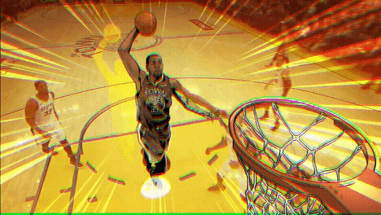
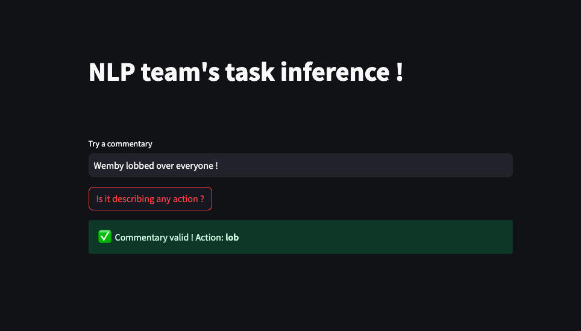

<a name="readme-top"></a>

<br />
<div align="center">
  <a href="https://github.com/marcusmicha/floater-shot">
    
  </a>

  <h3 align="center">Commentaries Inference</h3>
</div>


<!-- ABOUT THE PROJECT -->
## About The Project



In this project, we will try to solve the sport commentary content classification issue. In live sport, understanding commentaries is a the key to extract actionable data. We will attack the issue by solving 2 main point :

* The validity of the commentary
* The action described in the commentary


### Solution Architecture

```
`-- src
    |
    `-- config
    |    |-- training_config.yml
    |
    `-- model 
    |
    `-- data
    |    |-- data.pkl
    |
    |-- eda.ipynb
    |-- finetune.py
    |-- finetuner.py
    |-- inference.py
    |-- requirements.txt

```


<!-- GETTING STARTED -->
## Getting Started

Some instructions on setting up the project locally.

### Installation


1. Clone the repo
   ```sh
   git clone https://github.com/marcusmicha/floater-shot
   ```
2. Install PIP packages
   ```sh
   pip install -r requirements.txt
   ```
3. Download the **preprocessed data** and the **final model**. The code in the repo lets you recreate the data and the model from scratch but you want to skip the preprocess and training part you could.
The link to download it [Model and data](https://drive.google.com/drive/folders/1gLqjOfwZzMfcMYXBlPEGPMe-I8pAAKO_?usp=sharing)
- Unzip *model.zip* and place it at the src of the project
- Place *data.pkl* in the *data* folder at the src of the project


## EDA

Perfom EDA on the data, generate and save preprocess data by running the *eda.ipynb* notebook.


## Fine Tuning

We chose the fine tuning solution to solve the validity issue.
You can fine tune the model we chose by yourself by running
```sh
   python finetune.py
```

## Inference

You can run the streamlit application for inference wit this command
```sh
   streamlit run inference.py
```

## Contact

Feel free to contact my anytime if needed

